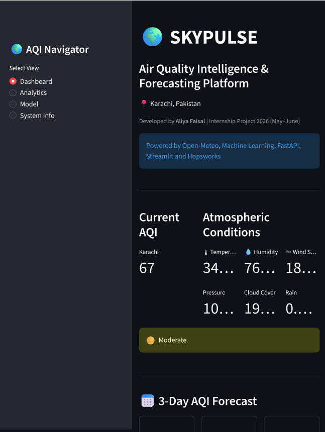
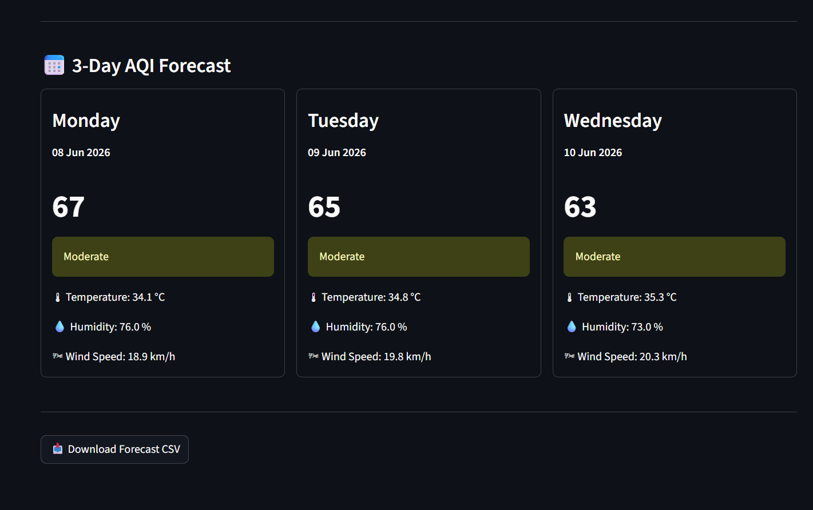
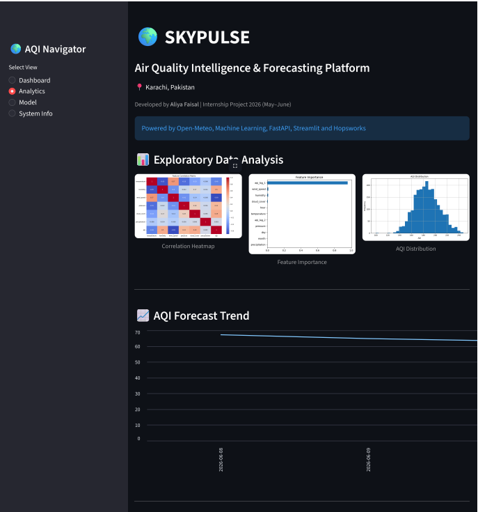
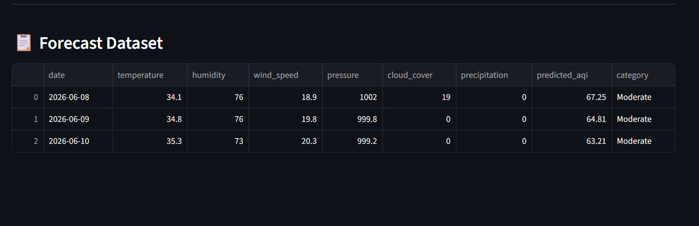
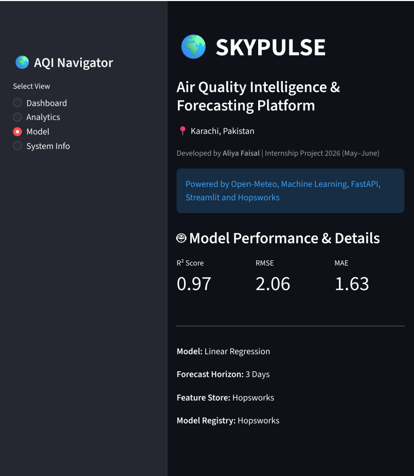
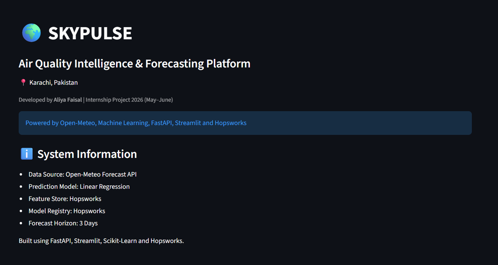

# 🌍 SkyPulse

### Air Quality Intelligence & Forecasting Platform

📍 Karachi, Pakistan

**Developed by:** Aliya Faisal
**Internship Project:** May–June 2026

---

## Overview

SkyPulse is an end-to-end Machine Learning and MLOps platform designed to forecast Air Quality Index (AQI) levels for Karachi using weather intelligence and predictive analytics.

The platform integrates weather forecasting, feature engineering, machine learning, FastAPI deployment, interactive Streamlit dashboards, and Hopsworks services to provide accurate three-day AQI forecasts.

---

## Problem Statement

Air pollution is a major environmental and public health challenge in urban areas. Accurate AQI forecasting enables citizens, researchers, and decision-makers to better understand future air quality conditions and take preventive actions when necessary.

The objective of SkyPulse is to develop a machine learning-based forecasting system capable of predicting AQI levels using historical weather patterns and future weather forecasts.

---

## Key Features

* 3-Day AQI Forecasting
* Real-Time Weather Forecast Integration
* Interactive Dashboard
* FastAPI Prediction Service
* Hopsworks Feature Store Integration
* Hopsworks Model Registry Integration
* Exploratory Data Analysis (EDA)
* Forecast Export Functionality
* Machine Learning Performance Monitoring

---

## Project Architecture

Open-Meteo Weather Forecast API
↓
Feature Engineering
↓
Machine Learning Model
↓
Hopsworks Model Registry
↓
FastAPI Prediction Service
↓
Streamlit Dashboard
↓
AQI Forecast & Analytics

---

## Technology Stack

### Data engineering

* Python
* Pandas
* NumPy

### Machine Learning

* Scikit-Learn
* Linear Regression
* Random Forest Regressor
* 
### Data Sources

* Open-Meteo Historical Weather API
* Open-Meteo Forecast API

## Technology Stack

### Programming & Data Processing

* Python
* Pandas
* NumPy

### APIs & Data Sources

* Open-Meteo Historical Weather API
* Open-Meteo Forecast API

### MLOps

* Hopsworks Feature Store
* Hopsworks Model Registry

### Deployment & Visualization

* FastAPI
* Streamlit

### Development Environment

* PyCharm
* GitHub

## Data Collection

Historical weather data for Karachi was collected using the Open-Meteo Historical Weather API.

The collected weather attributes include:

* Temperature
* Humidity
* Wind Speed
* Atmospheric Pressure
* Cloud Cover
* Precipitation

The dataset was generated using the `generate_historical_weather.py` script and stored for further preprocessing and model training.

### Dataset Statistics

* Location: Karachi, Pakistan
* Records: 2,208
* Time Granularity: Hourly
* Source: Open-Meteo

The resulting dataset was saved as:

```text
karachi_historical_weather.csv
```

## Feature Engineering

Feature engineering was performed to improve the predictive capability of the machine learning model.

In addition to the original weather variables, temporal and lag-based features were created to capture seasonal patterns and historical AQI behavior.

### Weather Features

* Temperature
* Humidity
* Wind Speed
* Atmospheric Pressure
* Cloud Cover
* Precipitation

### Time-Based Features

The following datetime features were extracted from the timestamp:

* Hour
* Day
* Month

These features help the model learn daily and seasonal trends in air quality.

### Lag Features

To capture historical AQI behavior, two lag variables were introduced:

* aqi_lag_1
* aqi_lag_2

These features represent AQI values from previous observations and help the model identify short-term AQI trends.

### Final Feature Set

The model was trained using the following features:

* temperature
* humidity
* wind_speed
* pressure
* cloud_cover
* precipitation
* hour
* day
* month
* aqi_lag_1
* aqi_lag_2

## Exploratory Data Analysis (EDA)

Exploratory Data Analysis was performed to better understand the relationships between weather conditions and AQI values.

Several visualizations were generated to identify important patterns and correlations within the dataset.

### Correlation Analysis

A correlation heatmap was created to analyze relationships between weather variables and AQI.

Key observations:

* Humidity showed a positive relationship with AQI.
* Wind Speed generally showed a negative relationship with AQI.
* Lag features demonstrated strong predictive value.

### AQI Distribution

The AQI distribution plot was used to understand the spread of air quality values across the dataset.

This analysis helped identify:

* Typical AQI ranges
* Data balance
* Potential outliers

### Feature Importance

Feature importance analysis was performed to determine which variables contribute most to AQI prediction.

Important predictors included:

* Previous AQI values (lag features)
* Temperature
* Humidity
* Wind Speed

### EDA Visualizations

* Correlation Heatmap
* AQI Distribution
* Feature Importance Analysis

## Machine Learning Model Training

The dataset was divided into training and testing sets using an 80:20 split.

Two machine learning algorithms were evaluated:

### Linear Regression

Linear Regression was used as a baseline model due to its simplicity and interpretability.

### Random Forest Regressor

Random Forest Regressor was evaluated to capture non-linear relationships between weather variables and AQI.

### Model Selection

Models were compared using standard regression evaluation metrics:

* Mean Absolute Error (MAE)
* Root Mean Squared Error (RMSE)
* R² Score

The model with the lowest RMSE was selected for deployment.

## Model Performance

The trained machine learning model was evaluated using standard regression metrics to measure prediction accuracy.

### Evaluation Metrics

| Metric   | Value |
| -------- | ----- |
| R² Score | 0.97  |
| RMSE     | 2.06  |
| MAE      | 1.63  |

### Metric Definitions

**R² Score**

Measures how well the model explains variations in AQI values. A score closer to 1 indicates better predictive performance.

**RMSE (Root Mean Squared Error)**

Measures the average prediction error while giving greater importance to larger errors.

**MAE (Mean Absolute Error)**

Measures the average absolute difference between predicted and actual AQI values.

### Performance Summary

The model achieved strong predictive performance with a high R² score and low prediction error, making it suitable for short-term AQI forecasting.

## Hopsworks Integration

Hopsworks was used to manage machine learning assets and support the MLOps workflow.

### Feature Store

The Feature Store was used to store engineered features and maintain consistent feature definitions for model training and inference.

### Model Registry

The trained model was registered in the Hopsworks Model Registry to enable version control and deployment management.

### Benefits

* Centralized feature management
* Model versioning
* Reproducible machine learning workflows
* Simplified deployment process

## FastAPI Deployment

A FastAPI application was developed to serve AQI predictions through a REST API.

### Forecast Endpoint

```text
GET /forecast
```

### Example Response

```json
{
  "city": "Karachi",
  "forecast": [
    {
      "date": "2026-06-01",
      "predicted_aqi": 68.5
    }
  ]
}
```

### Running the API

```bash
uvicorn app:app --reload
```

The API retrieves forecast weather data, performs feature preparation, loads the trained model, and returns AQI predictions for the next three days.

## Streamlit Dashboard

An interactive Streamlit dashboard was developed to visualize AQI forecasts, weather conditions, model information, and analytics.

### Dashboard Features

#### Dashboard Page

The Dashboard page displays:

* Current AQI prediction
* AQI category classification
* Atmospheric conditions
* Temperature
* Humidity
* Wind Speed
* Pressure
* Cloud Cover
* Precipitation
* Three-day AQI forecast cards

#### Analytics Page

The Analytics page provides:

* Correlation Heatmap
* AQI Distribution Analysis
* Feature Importance Visualization
* Forecast Dataset View
* AQI Trend Chart

#### Model Page

The Model page presents:

* Machine Learning Algorithm Information
* Model Evaluation Metrics
* R² Score
* RMSE
* MAE

#### System Information Page

The System Information page includes:

* Data Source Information
* Model Details
* Feature Store Details
* Model Registry Information
* Forecast Horizon Details

### Forecast Export

Users can download forecast results as a CSV file directly from the dashboard.

### Running the Dashboard

```bash
streamlit run dashboard.py
```
## Results

The SkyPulse platform successfully generates three-day AQI forecasts for Karachi using forecast weather data and machine learning models.

The system provides:

* AQI Predictions
* Weather Forecast Information
* Interactive Visualizations
* Forecast Export Capability
* Machine Learning Performance Insights

The deployed application demonstrates a complete end-to-end machine learning workflow from data acquisition and feature engineering to prediction serving and visualization.
## Project Structure

```text
SkyPulse/
│
├── app.py
├── dashboard.py
├── model.py
├── generate_historical_weather.py
├── historical_backfill.py
├── requirements.txt
│
├── reports/
│   ├── correlation_heatmap.png
│   ├── feature_importance.png
│   └── aqi_distribution.png
│
├── screenshots/
│   ├── dashboard.png
│   ├── analytics.png
│   └── architecture.png
│
└── README.md
```
## Future Enhancements

Future versions of SkyPulse may include:

* Multi-city AQI forecasting
* Real-time AQI sensor integration
* Advanced ensemble machine learning models
* Automated model retraining
* Cloud deployment
* Mobile-responsive dashboard enhancements
* Historical AQI trend analysis
## Conclusion

SkyPulse demonstrates the implementation of an end-to-end Machine Learning and MLOps workflow for air quality forecasting.

The project combines data collection, feature engineering, machine learning, model management, API deployment, and interactive visualization to deliver an intelligent AQI forecasting platform for Karachi.

Through the integration of FastAPI, Streamlit, Open-Meteo, and Hopsworks, the platform showcases practical applications of data engineering, machine learning, and MLOps concepts in a real-world environmental use case.

---

**Developed by Aliya Faisal**
**Internship Project – May–June 2026**
## Installation & Setup

### Clone Repository

```bash
git clone <repository-url>
cd SkyPulse
```

### Create Virtual Environment

```bash
python -m venv .venv
```

### Activate Environment

Windows:

```bash
.venv\Scripts\activate
```

Linux / Mac:

```bash
source .venv/bin/activate
```

### Install Dependencies

```bash
pip install -r requirements.txt
```

### Start FastAPI Service

```bash
uvicorn app:app --reload
```

FastAPI will run at:

```text
http://127.0.0.1:8000
```

### Start Streamlit Dashboard

```bash
streamlit run dashboard.py
```

The dashboard will open automatically in your browser.
## Screenshots

### Dashboard




### Analytics




### Model


### System Information


