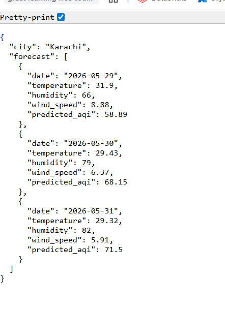
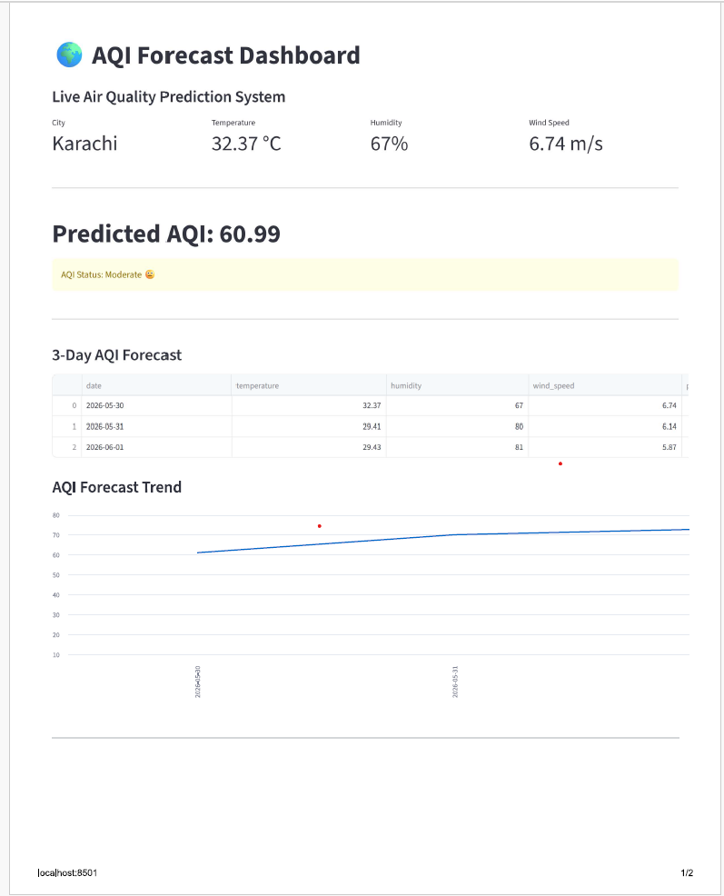
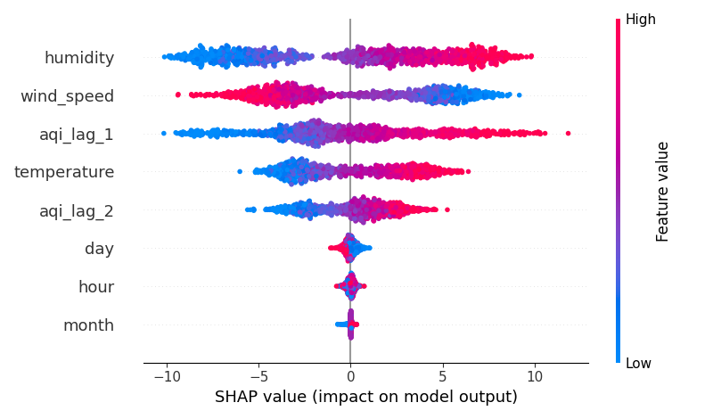

# AQI Forecast Project

Machine Learning Air Quality Index (AQI) Forecasting System built using Python, FastAPI, Streamlit, Hopsworks Feature Store, and OpenWeather API.

---

## Project Overview

This project predicts Air Quality Index (AQI) using weather conditions and machine learning.

The system:

- Collects real-time weather data
- Generates AQI features
- Trains a Random Forest model
- Predicts AQI values
- Displays results through FastAPI and Streamlit dashboards
- Stores features in Hopsworks Feature Store
- Explains model predictions using SHAP

---

## Technologies Used

- Python
- Pandas
- Scikit-Learn
- FastAPI
- Streamlit
- Hopsworks
- OpenWeather API
- SHAP
- GitHub

---

## Project Structure

```text
app.py
dashboard.py
collect_data.py
feature_pipeline.py
train_model.py
predict.py
model.py
register_model.py
deploy_model.py
shap_analysis.py
```

## Machine Learning Pipeline

1. Collect Weather Data
2. Generate AQI Features
3. Create Historical Dataset
4. Train Random Forest Model
5. Evaluate Model
6. Register Model
7. Deploy FastAPI Endpoint
8. Visualize Predictions

---

## API Endpoint

Run FastAPI:

```bash
uvicorn app:app --reload
```

API URL:

```text
http://127.0.0.1:8000/forecast
```

---

## Streamlit Dashboard

Run:

```bash
streamlit run dashboard.py
```

---

## Model Explainability

Generate SHAP analysis:

```bash
python shap_analysis.py
```

Output:

```text
shap_summary.png
```

---

## Sample Prediction

```json
{
  "city": "Karachi",
  "forecast": [
    {
      "date": "2026-05-22",
      "predicted_aqi": 61.63
    },
    {
      "date": "2026-05-23",
      "predicted_aqi": 64.15
    },
    {
      "date": "2026-05-24",
      "predicted_aqi": 69.51
    }
  ]
}
```

---

## Author

Aliya Aslam

Data Engineering & Machine Learning Internship Project
## Screenshots

### FastAPI Forecast API



### Streamlit Dashboard



### SHAP Feature Importance

